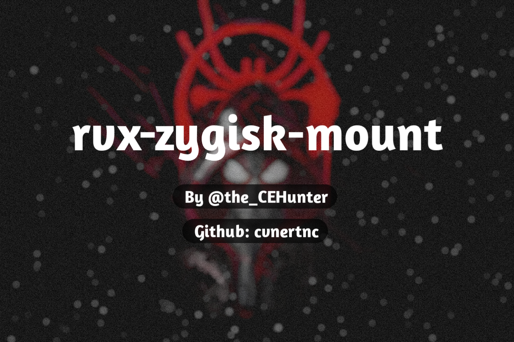

#### ⚠️ [Original Repo](https://github.com/j-hc/rvmm-zygisk-mount)

# rvx-zygisk-mount

Injects the mounts at the pre app specialization with Zygisk (for [rvx-app](https://github.com/cvnertnc/rvx-app)).

Fixes problems such as,
- "Reflash needed" error after reboots
- "Suspicious mount detected" warnings from root detector apps

If you are using rvx-app from rebanders, who completely remove my name from the modules, rvx-zygisk-mount wont work.

## Usage
- Make sure the modules of whichever app you want is installed from rvx-app
- Flash rvx-zygisk-mount module. It will automatically take care of everything
- **Do not** put the patched apps you want in the denylist

#### You do not need to use this module. The classic mount method of rvx-app is just fine for many people.
#### Use this only if you need to, or you are having trouble with the classic mount method.

## Thanks
[j-hc](https://github.com/j-hc)  
